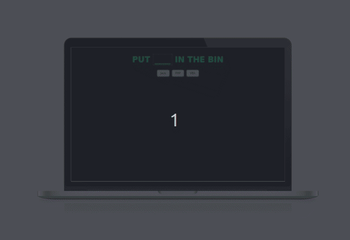

# React Drag-Drop-Container

Sometimes you just need to put PHP in the bin. 

Available [here](https://eukalytics.github.io/dragdrop/).

Playing around with [react-drag-drop-container](https://github.com/peterh32/react-drag-drop-container).

To get me up and running use `npm i` and then `npm start`.